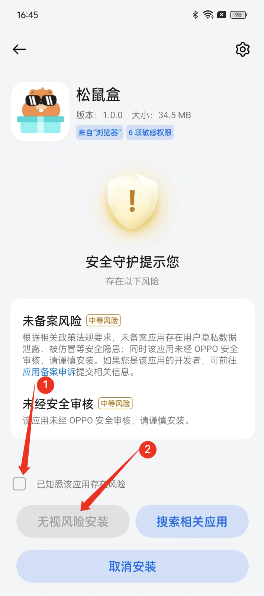
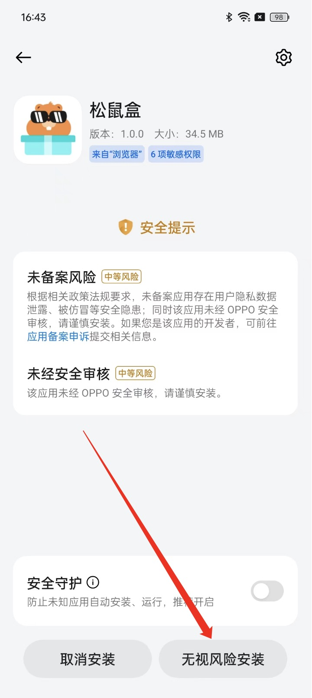
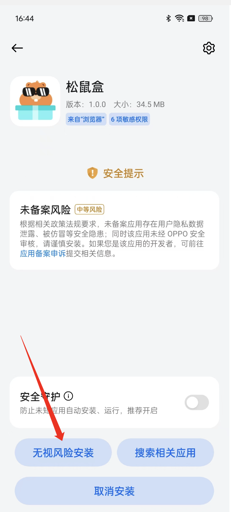

## vivo 用户安装注意事项

在使用 vivo 手机安装 APK 文件时，可能会遇到一些系统提示和安全限制。本文将详细介绍常见问题及其解决方案，帮助用户顺利安装所需应用。

### 1. 未经 oppo 安全审核

#### 问题
在安装 APK 文件时提示：提示未经 oppo 安全审核，请谨慎安装

#### 解决方案
勾选已知悉，点击继续安装

### 2. 安全提示
#### 问题
在安装 APK 文件时提示：该应用未经 OPPO 安全审核，请谨慎安装，或者是提示未备案风险。

#### 解决方案
忽略提醒，点击 无视风险安装

### 3. 未备案风险
#### 问题
在安装 APK 文件时提示：提示应用存在未备案风险。

#### 解决方案
忽略提醒，点击 无视风险安装

