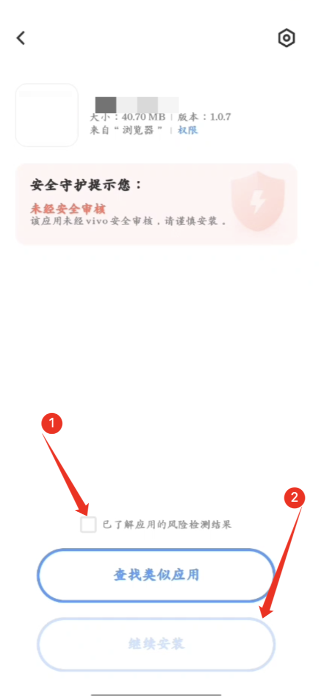
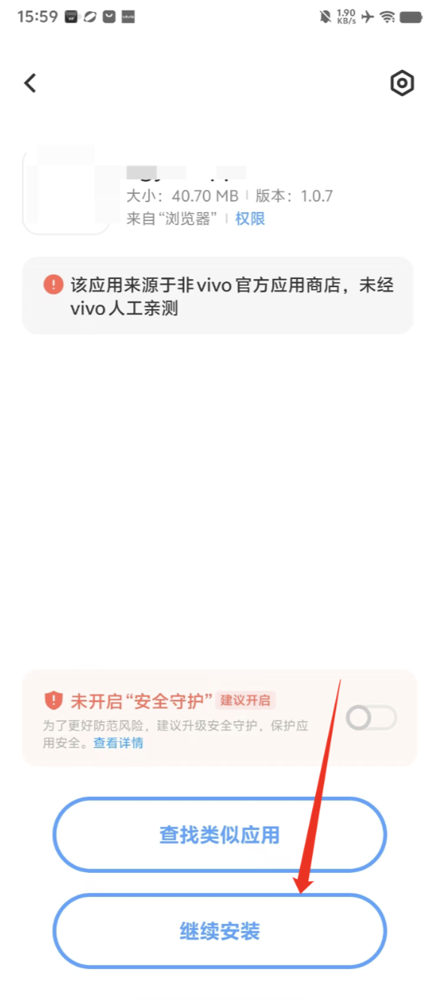

## vivo 用户安装注意事项

在使用 vivo 手机安装 APK 文件时，可能会遇到一些系统提示和安全限制。本文将详细介绍常见问题及其解决方案，帮助用户顺利安装所需应用。

### 1. 提示未经 vivo 安全审核

#### 问题
在安装 APK 文件时提示：未经 vivo 安全审核，请谨慎安装

#### 解决方案
勾选已了解风险，点击“继续安装”

### 2. 未经 vivo 人工亲测
#### 问题
在安装 APK 文件时提示：应用来源于非 vivo 官方应用商店，未经 vivo 人工亲测

#### 解决方案
忽略提醒，点击“继续安装”

