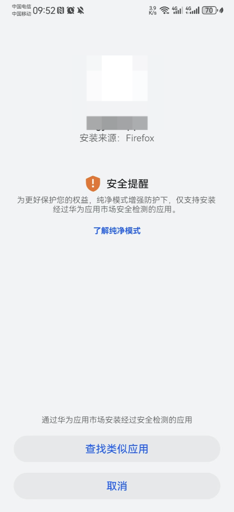
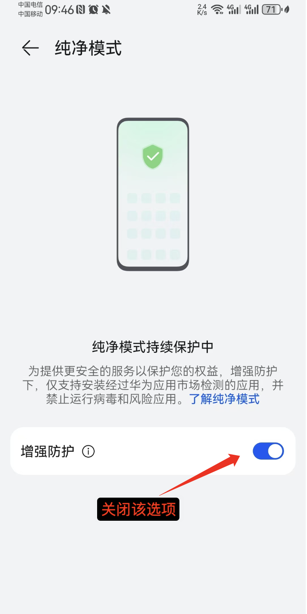
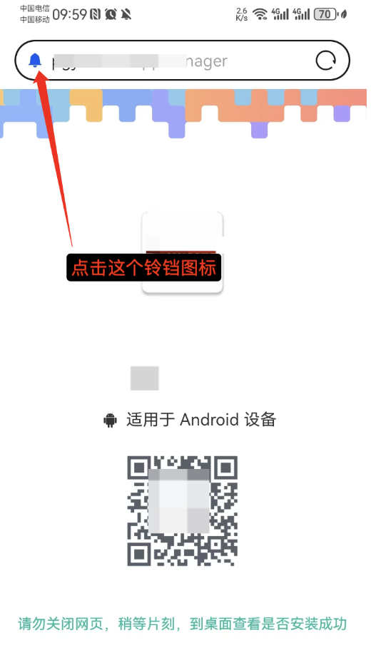
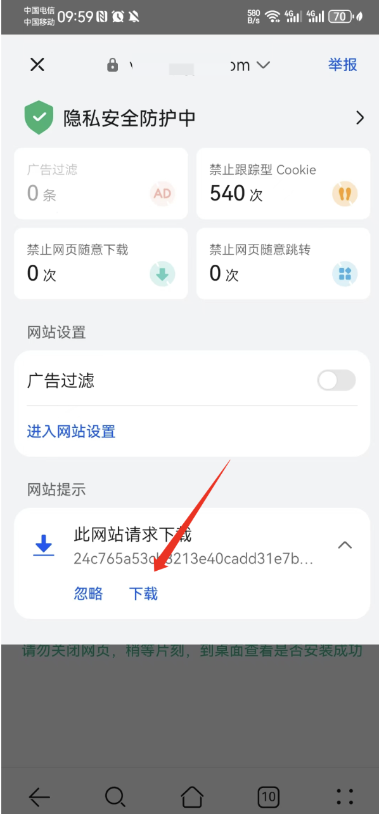
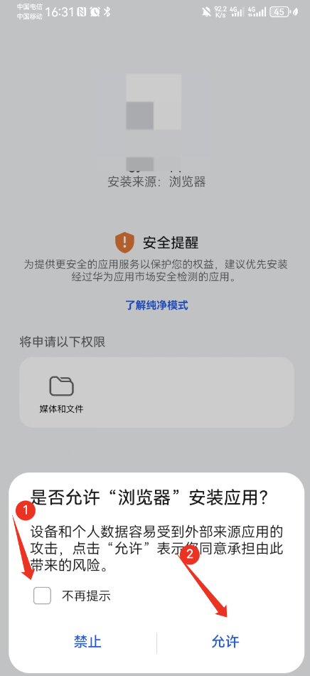
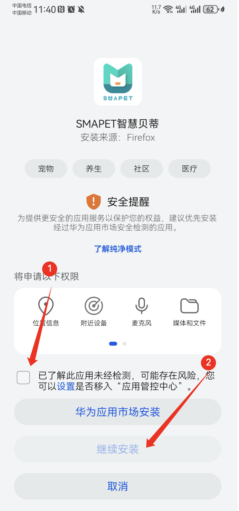

## 华为/荣耀用户安装注意事项

在使用华为和荣耀手机安装 APK 文件时，可能会遇到一些系统提示和安全限制。本文将详细介绍常见问题及其解决方案，帮助用户顺利安装所需应用。
	
### 1. 纯净模式

#### 问题
在开启纯净模式后无法安装非华为市场应用，没有安装的按钮

提示如下图所示：

#### 解决方案： 
关闭纯净模式，然后重新打开 APK 文件进行安装.
- 打开“设置”应用。
- 进入“系统和更新”。
- 进入“纯净模式”，关闭“增强防护”。

也可以在设置中搜索 纯净模式, 进入纯净模式设置

### 2. 在华为系统浏览器中没有下载提示
#### 问题
这种情况一般是由于系统浏览器弹出下载提示弹窗后，如果用户没有操作，几秒钟后浏览器会自动隐藏下载提示弹窗

#### 解决方案： 
- 点击浏览器链接前面的铃铛
- 然后在弹窗的底部就可以看到下载文件的提示，点击“下载”即可

### 3.安装未知来源应用 
#### 问题
安装 APK 时需要授予该应用安装权限才能正常安装应用。

#### 解决方案 
在打开 APK 文件时授予应用安装权限

### 4. 遇到推荐安装应用市场的应用

#### 问题
在安装 APK 时，系统可能推荐用户通过华为应用市场下载相同的应用，而不是直接安装 APK 文件。

#### 解决方案
用户可以选择忽略推荐，继续安装已下载的 APK 文件：
- 在应用安装界面中，勾选“已了解此应用未经检测”，点击“继续安装”完成应用的安装。

### 总结

华为和荣耀手机在安装APK文件时，可能会遇到各种系统提示和安全限制。用户可以按照本文提供的解决方案，逐一排查并解决问题，以顺利完成应用安装。在安装过程中，用户需要注意系统弹出的各种提示信息，并根据实际情况选择相应的操作。