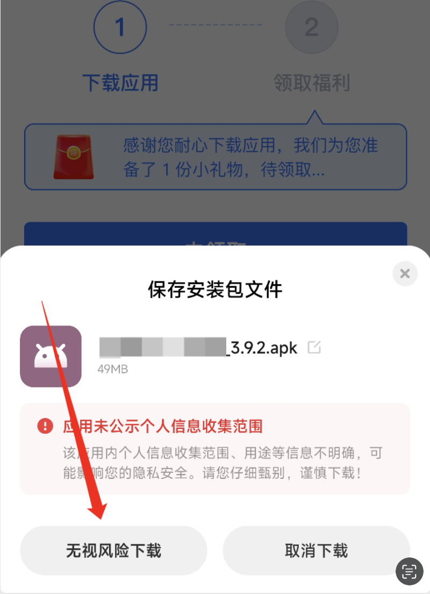
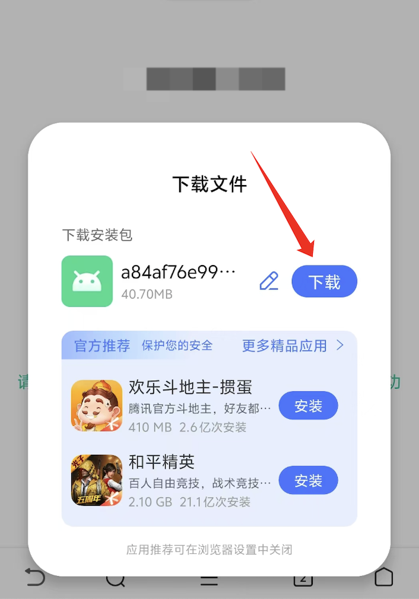

## 小米和红米手机用户安装注意事项

在使用小米和红米手机安装 APK 文件时，可能会遇到一些系统提示和安全限制。本文将详细介绍常见问题及其解决方案，帮助用户顺利安装所需应用。

### 1. 系统安全中心限制

#### 问题
小米手机的安全中心可能会拦截未知来源或未经审核的应用，阻止用户安装这些应用。

#### 解决方案
在 MIUI 安全中心中，可以设置允许从未知来源安装应用或者关闭应用安全扫描功能：
- 打开“设置”应用。
- 进入“密码与安全”或“其他高级设置”。
- 找到“安装未知应用”，并选择允许相应的应用进行安装。
- 或者，打开安全中心，进入“安全扫描”，关闭相关的安全扫描功能。

### 2. 提示应用存在风险

#### 问题
在用户尝试安装 APK 文件时，会弹出安全警告，提示该应用可能存在风险。

#### 解决方案
用户需要手动选择“继续安装”或“了解风险”即可继续安装：
- 在弹出的安全警告中，选择“继续安装”。
- 或者点击“了解风险”，并确认继续安装。

### 3. 提示安装包未经小米安全审核

#### 问题
在用户下载包时，浏览器下载弹窗中提示应用未经小米安全审核。

#### 解决方案
请忽略提示，点击包文件旁的“下载”按钮即可：
- 当弹出提示时，直接点击下载按钮，无需理会安全审核提示。

### 4. 提示安装包未经过安全检测

#### 问题
在用户安装APK文件时，系统可能提示安装包未经过安全检测。

#### 解决方案
请忽略提示，选择“继续安装”即可：
- 在提示弹出时，选择“继续安装”，忽略未经过安全检测的警告。

### 5. 应用未公示个人信息收集范围

#### 问题
在用户安装APK文件时，系统可能提示应用未公示个人信息收集范围。

#### 解决方案
忽略提示，请选择“无视风险下载”即可（文字可能较小，请用户注意观察）：
- 在提示中，找到并选择“无视风险下载”，忽略相关提示。

### 6. 遇到推荐安装应用市场的应用

#### 问题
在安装 APK 时，系统可能推荐用户通过小米应用市场下载相同的应用，而不是直接安装 APK 文件。

#### 解决方案
用户可以选择忽略推荐，继续安装已下载的 APK 文件：
- 在推荐安装弹出时，选择“取消”或“忽略推荐”，继续安装已下载的 APK 文件。

### 7. 下载文件遇到推荐安装应用市场的应用

#### 问题
在下载 APK 时，浏览器中下载弹窗会推荐用户一些其他的推广应用

#### 解决方案
- 在推荐安装弹出时，点击“下载”按钮，忽略推荐的应用。
- 在浏览器设置中关闭推荐。

### 总结

小米和红米手机在安装APK文件时，可能会遇到各种系统提示和安全限制。用户可以按照本文提供的解决方案，逐一排查并解决问题，以顺利完成应用安装。在安装过程中，用户需要注意系统弹出的各种提示信息，并根据实际情况选择相应的操作。
